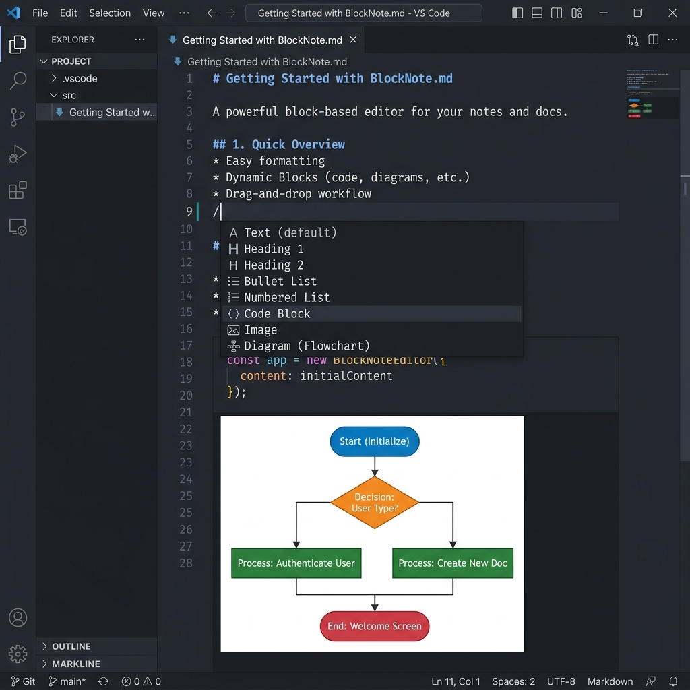

# BlockNote Markdown Editor

<p align="center">
  
</p>

A Notion-like, rich visual markdown editor for VS Code, powered by [BlockNote](https://www.blocknotejs.org).

Opens `.md` files as an interactive block editor with inline live preview — no split panes, no raw markdown clutter. All edits are automatically serialized and saved back to disk as clean, standard markdown, keeping your files fully portable.

---

## 🚀 Features

### ✨ Intuitive WYSIWYG Editing
- **Block-Based Layout**: Create content using an intuitive block system.
- **Drag-and-Drop**: Easily reorder blocks or structure content by dragging blocks around.
- **Slash Commands (`/`)**: Type `/` to open a quick-insert menu for headings, lists, tables, code blocks, dividers, and more.
- **Standard Formatting**: Full support for Headings (H1–H3), bold, italics, strikethrough, quotes, lists (bullet, numbered, check lists), and dividers.

### 💻 Rich Code Blocks & Syntax Highlighting
- **Embedded Shiki Highlighter**: Code blocks render with accurate syntax highlighting powered by [Shiki](https://shiki.matsu.io) using the `github-light` theme.
- **Multi-language Support**: Fully supports popular programming languages including JavaScript, TypeScript, Python, Bash, Go, Rust, Java, SQL, HTML, CSS, JSON, YAML, and Plain Text.
- **Language Selector**: Seamlessly switch languages directly from the block toolbar.

### 📊 Live Mermaid Diagrams
- **Visual Renders**: Insert diagrams using the `/Mermaid Diagram` command.
- **Interactive Editing**: Click **✎ Edit source** to expand and modify the Mermaid source code, and **▲ Hide source** to collapse it.
- **Universal Portability**: Renders live inside the editor but saves as standard ` ```mermaid ` code blocks, making them fully compatible with GitHub and other markdown tools.

### 📅 Smart Date Picker
- **Slash Commands**: Quickly insert today's or tomorrow's date with `/Today` or `/Tomorrow`.
- **Date Picker Dialog**: Use `/Pick a Date` to select any date using an interactive visual calendar.

---

## 📦 Installation

Install **BlockNote Editor** via:
- **VS Code Marketplace**: Search for `BlockNote Markdown Editor`
- **Open VSX Registry**: Search for `BlockNote Editor`
- **VSIX Install**: Download the `.vsix` from [GitHub Releases](https://github.com/vikash1a/blocknote-editor/releases), open the Command Palette (`Cmd+Shift+P` / `Ctrl+Shift+P`), and run **Extensions: Install from VSIX...**

---

## 🛠️ Usage & Configuration

When you open any `.md` file, the BlockNote visual editor will open automatically.

### Switching Editors
If you need to view or edit the raw markdown text:
1. Right-click the document tab.
2. Select **Reopen Editor With...**
3. Choose **Text Editor** (or **BlockNote Editor** to switch back).

### Make BlockNote the Default Editor
To set BlockNote as your default editor for all markdown files, add the following configuration to your `settings.json`:

```json
"workbench.editorAssociations": {
  "*.md": "blocknote-editor.markdownEditor"
}
```

---

## ⚠️ Caveats & Portability

The editor uses standard markdown serialization to save files. However, markdown conversion can be lossy:
- Extremely complex raw HTML, markdown footnotes, or deeply nested structures may not round-trip identically.
- Core elements (headings, tables, text formatting, code blocks, lists, and Mermaid diagrams) are fully supported and preserve layout.

---

## 📄 License

This extension is licensed under the [MIT License](LICENSE).
