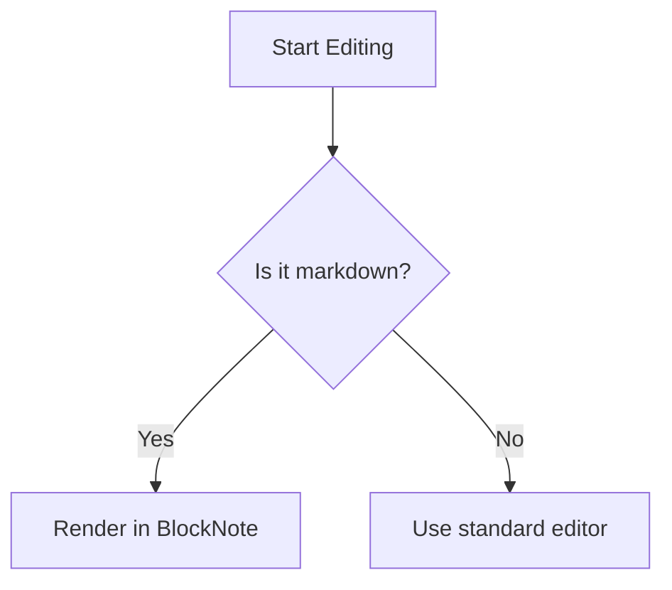

# BlockNote Editor Demo

This document showcases the rich interactive editing features available in the visual block editor.

## Text & Typography

BlockNote supports standard typographic elements with intuitive visual hierarchy:
- **Bold**, *italic*, ~~strikethrough~~, and `inline code` styling.
- Headings from level 1 to 3.

> BlockNote brings the power of Notion-style block editing and portability of markdown directly into VS Code. 

## Tables

Organize your structured data seamlessly:

| Feature | Supported | Description |
| :--- | :--- | :--- |
| WYSIWYG Editing | Yes | Edit directly in visual preview |
| Slash Commands | Yes | Press `/` to insert block types |
| Custom Blocks | Yes | Mermaid diagrams, dates, images |

## Dynamic Date Blocks

You can quickly insert dates using slash commands (`/Today`, `/Tomorrow`, or `/Pick a Date`):
📅 June 14, 2026

## Code Blocks & Highlighting

Syntax highlighting is powered by **Shiki** with support for popular languages:

```javascript
// Function to greet the user
function greet(name) {
  const message = `Welcome to BlockNote, ${name}!`;
  console.log(message);
  return message;
}
```

## Live Mermaid Diagrams

Render complex diagrams directly inside the editor:


