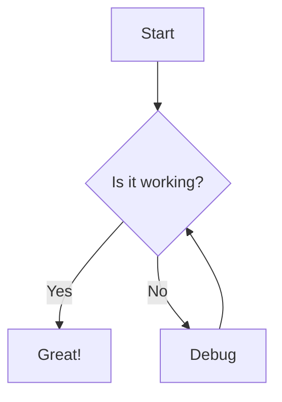
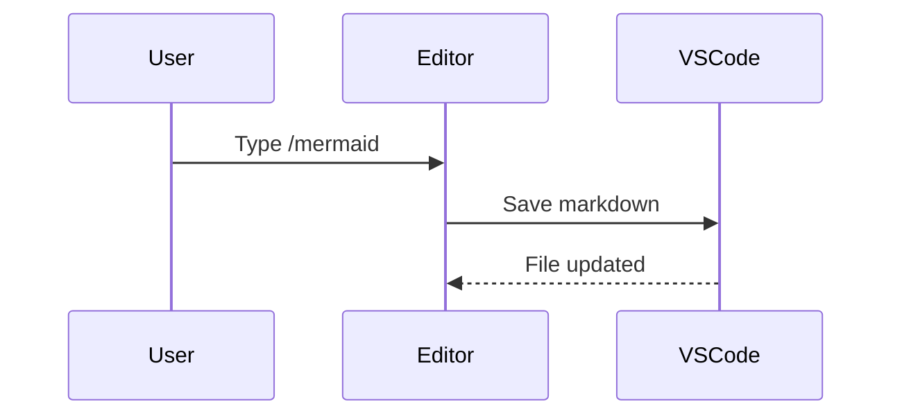
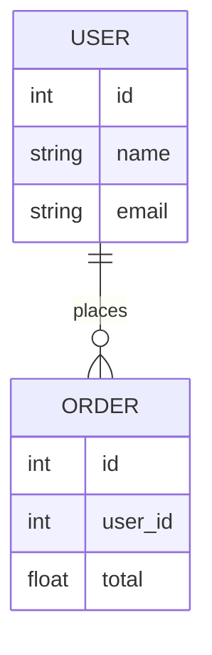

# Syntax Highlighting & Mermaid Test

## Mermaid — Flowchart



## Mermaid — Sequence Diagram



## Mermaid — Entity Relationship



# Syntax Highlighting Test

## JavaScript

```javascript
function greet(name) {
  const message = `Hello, ${name}!`;
  console.log(message);
  return message;
}

greet("world");
```

## TypeScript

```typescript
interface User {
  id: number;
  name: string;
  email?: string;
}

const getUser = async (id: number): Promise<User> => {
  const res = await fetch(`/api/users/${id}`);
  return res.json();
};
```

## Python

```python
def fibonacci(n: int) -> list[int]:
    a, b = 0, 1
    result = []
    for _ in range(n):
        result.append(a)
        a, b = b, a + b
    return result

print(fibonacci(10))
```

## Bash

```bash
#!/bin/bash
for file in *.md; do
  echo "Processing $file"
  wc -l "$file"
done
```

## Go

```go
package main

import "fmt"

func main() {
    nums := []int{1, 2, 3, 4, 5}
    sum := 0
    for _, n := range nums {
        sum += n
    }
    fmt.Printf("Sum: %d\n", sum)
}
```

## Rust

```rust
fn main() {
    let numbers = vec![1, 2, 3, 4, 5];
    let sum: i32 = numbers.iter().sum();
    println!("Sum: {}", sum);
}
```

## SQL

```sql
SELECT u.name, COUNT(o.id) AS order_count
FROM users u
LEFT JOIN orders o ON u.id = o.user_id
WHERE u.created_at > '2024-01-01'
GROUP BY u.id, u.name
ORDER BY order_count DESC;
```

## JSON

```json
{
  "name": "blocknote-editor",
  "version": "0.0.1",
  "features": ["syntax-highlighting", "slash-commands", "dates"],
  "active": true
}
```

## HTML

```html
<!DOCTYPE html>
<html lang="en">
  <head>
    <meta charset="UTF-8" />
    <title>Hello</title>
  </head>
  <body>
    <h1 class="title">Hello, world!</h1>
  </body>
</html>
```

## CSS

```css
.code-block {
  background-color: #f0f0f0;
  border-radius: 6px;
  padding: 12px 16px;
  font-family: monospace;
  font-size: 0.85em;
}
```

## YAML

```yaml
name: CI
on:
  push:
    branches: [main]
jobs:
  build:
    runs-on: ubuntu-latest
    steps:
      - uses: actions/checkout@v3
      - run: npm install && npm test
```

## Plain Text

```text
This is plain text with no syntax highlighting.
Just raw content, no colors.
```
